# Artificial Intelligence and Machine Learning on Azure

## Certification Pages

* [DP-100](https://learn.microsoft.com/en-us/credentials/certifications/azure-data-scientist/?practice-assessment-type=certification) 
* [AI-102](https://learn.microsoft.com/en-us/credentials/certifications/azure-ai-engineer/?practice-assessment-type=certification)  

### Practice Exams

* Microsoft Official 
  * DP-100 [Practice Exam](https://learn.microsoft.com/en-us/credentials/certifications/azure-data-scientist/practice/assessment?assessment-type=practice&assessmentId=62&practice-assessment-type=certification)
  * AI-102 [Practice Exam](https://learn.microsoft.com/en-us/credentials/certifications/azure-ai-engineer/practice/assessment?assessment-type=practice&assessmentId=61&practice-assessment-type=certification)
* [Whizlab](https://www.whizlabs.com)
* [TestPrepTraining](https://www.testpreptraining.com)

## AI Machine Learning Studio 

**Topics Covered**

* AI/ML Primer
  * Introduction to AI/ML concepts
  * Supervised vs Unsupervised Machine Learning 
  * Classification 
  * Regression 
  * Clustering 
  * Time Series Analysis and Forecasting
  * Data Preprocessing
    * Normalization & Standardization
    * Categorical Encoding/One-Hot Encoding
    * Train/Test Split
    * K-fold Cross Validation 

  * Model Training/Fitting
  * Model Evaluation 
  * CRISP-DM
  * Model Inferencing
  * MLOps

* Intro to Azure ML Workspace
* [Azure Machine Learning Studio]( https://ml.azure.com)

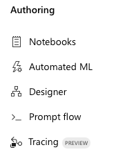

* Using Notebooks in Azure ML Studio
* Using Automated ML in Azure ML Studio

* Using Designer in Azure ML Studio

### Azure AI Services

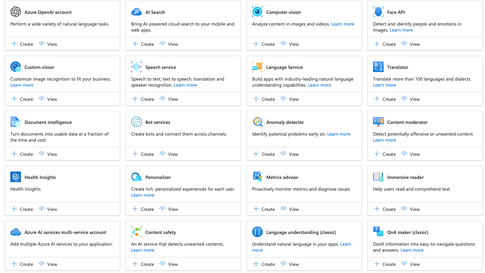

* Azure AI Playground
  * [Azure AI Vision Studio](https://portal.vision.cognitive.azure.com/gallery/featured)
  * [Azure AI Language Studio](https://language.cognitive.azure.com)
* Azure AI Services Multi-Service Account
  * API Key and Service Endpoint 
    * AI Vision 
      * Image classification 
      * Image captioning 
      * Content moderation 
      * Object detection
      * Custom image classification 

    * AI Language 
      * Language detection
      * Language translation
      * Content moderation 
      * Sentiment analysis 
      * Entity recognition 

* [Azure AI Studio](https://ai.azure.com/)

## K-fold Cross Validation

* [Data Splits and Cross Validation](https://learn.microsoft.com/en-us/azure/machine-learning/how-to-configure-cross-validation-data-splits?view=azureml-api-1)

> K-fold cross validation is a robust method for evaluating the performance of a machine learning model. Its main purpose is to ensure that the model is not overfitting and can generalize well to unseen data. Overfitting occurs when a model performs well on training data but poorly on new, unseen data
>
> 1. **Splitting the Data:** The dataset is divided into*k* equally sized folds or subsets.
> 2. **Training and Validation:** The model is trained *k* times, each time using a different fold as the validation set and the remaining *k*−1 folds as the training set.
> 3. **Performance Measurement:** The performance metrics (e.g., accuracy, precision, recall) are calculated for each iteration.
> 4. **Averaging Results:** The final performance score is obtained by averaging the results from all *k* iterations.

[source](https://scikit-learn.org/stable/modules/cross_validation.html)

### **Standard K-fold Cross Validation vs Time Series K-fold Cross Validation**

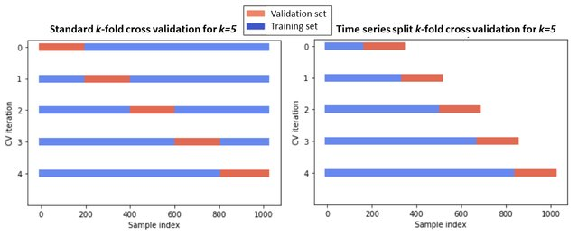

[source](https://www.researchgate.net/publication/355889701_Predicting_the_Price_of_Crude_Oil_and_its_Fluctuations_Using_Computational_Econometrics_Deep_Learning_LSTM_and_Convolutional_Neural_Networks)

## ML Evaluation Metrics and Scores

* [Evaluate automated machine learning experiment results](https://learn.microsoft.com/en-us/azure/machine-learning/how-to-understand-automated-ml?view=azureml-api-2)

| Metric                         | Description                                                  | Calculation                                                  |
| :----------------------------- | :----------------------------------------------------------- | :----------------------------------------------------------- |
| explained_variance             | Explained variance measures the extent to which a model accounts for the variation in the target variable. It is the percent decrease in variance of the original data to the variance of the errors. When the mean of the errors is 0, it is equal to the coefficient of determination (see r2_score below).   **Objective:** Closer to 1 the better  **Range:** (-inf, 1] | [Calculation](https://scikit-learn.org/0.22/modules/generated/sklearn.metrics.explained_variance_score.html) |
| mean_absolute_error            | Mean absolute error is the expected value of absolute value of difference between the target and the prediction.  **Objective:** Closer to 0 the better  **Range:** [0, inf)   Types:  `mean_absolute_error` `normalized_mean_absolute_error`, the mean_absolute_error divided by the range of the data. | [Calculation](https://scikit-learn.org/0.22/modules/generated/sklearn.metrics.mean_absolute_error.html) |
| mean_absolute_percentage_error | Mean absolute percentage error (MAPE) is a measure of the average difference between a predicted value and the actual value.  **Objective:** Closer to 0 the better  **Range:** [0, inf) |                                                              |
| median_absolute_error          | Median absolute error is the median of all absolute differences between the target and the prediction. This loss is robust to outliers.  **Objective:** Closer to 0 the better  **Range:** [0, inf)  Types:  `median_absolute_error` `normalized_median_absolute_error`: the median_absolute_error divided by the range of the data. | [Calculation](https://scikit-learn.org/0.22/modules/generated/sklearn.metrics.median_absolute_error.html) |
| r2_score                       | R2 (the coefficient of determination) measures the proportional reduction in mean squared error (MSE) relative to the total variance of the observed data.   **Objective:** Closer to 1 the better  **Range:** [-1, 1]  Note: R2 often has the range (-inf, 1]. The MSE can be larger than the observed variance, so R2 can have arbitrarily large negative values, depending on the data and the model predictions. Automated ML clips reported R2 scores at -1, so a value of -1 for R2 likely means that the true R2 score is less than -1. Consider the other metrics values and the properties of the data when interpreting a negative R2 score. | [Calculation](https://scikit-learn.org/0.22/modules/generated/sklearn.metrics.r2_score.html) |
| root_mean_squared_error        | Root mean squared error (RMSE) is the square root of the expected squared difference between the target and the prediction. For an unbiased estimator, RMSE is equal to the standard deviation.  **Objective:** Closer to 0 the better  **Range:** [0, inf)  Types: `root_mean_squared_error` `normalized_root_mean_squared_error`: the root_mean_squared_error divided by the range of the data. | [Calculation](https://scikit-learn.org/0.22/modules/generated/sklearn.metrics.mean_squared_error.html) |
| root_mean_squared_log_error    | Root mean squared log error is the square root of the expected squared logarithmic error.  **Objective:** Closer to 0 the better  **Range:** [0, inf)   Types:  `root_mean_squared_log_error` `normalized_root_mean_squared_log_error`: the root_mean_squared_log_error divided by the range of the data. | [Calculation](https://scikit-learn.org/0.22/modules/generated/sklearn.metrics.mean_squared_log_error.html) |
| spearman_correlation           | Spearman correlation is a nonparametric measure of the monotonicity of the relationship between two datasets. Unlike the Pearson correlation, the Spearman correlation does not assume that both datasets are normally distributed. Like other correlation coefficients, Spearman varies between -1 and 1 with 0 implying no correlation. Correlations of -1 or 1 imply an exact monotonic relationship.   Spearman is a rank-order correlation metric meaning that changes to predicted or actual values will not change the Spearman result if they do not change the rank order of predicted or actual values.  **Objective:** Closer to 1 the better  **Range:** [-1, 1] | [Calculation](https://docs.scipy.org/doc/scipy-1.5.2/reference/generated/scipy.stats.spearmanr.html) |

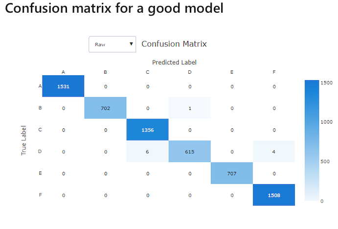

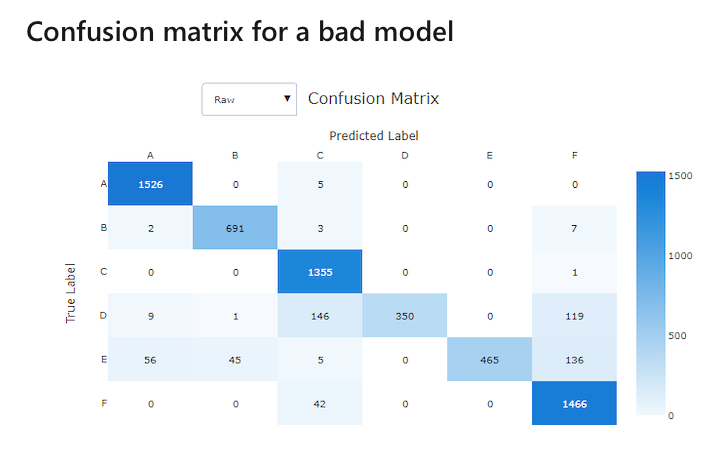

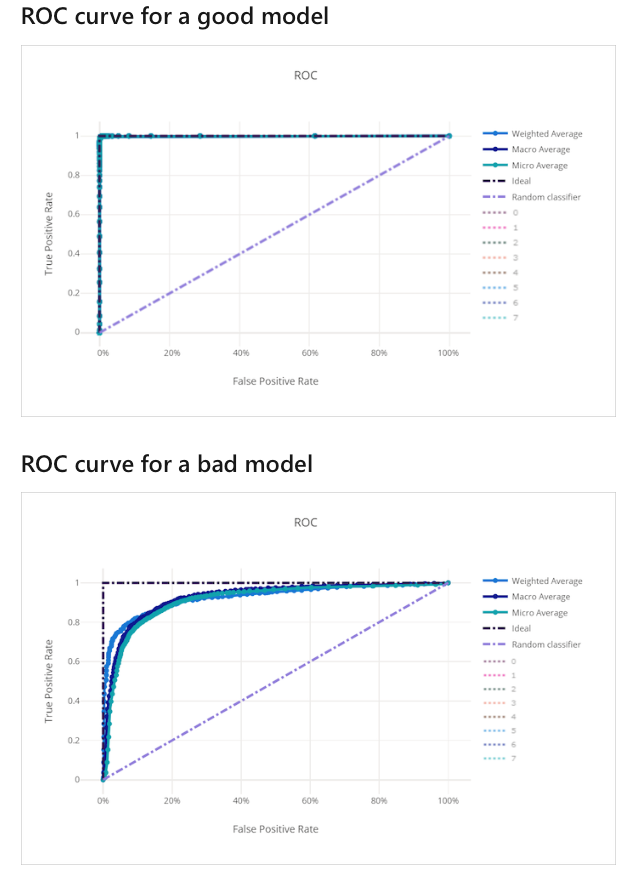

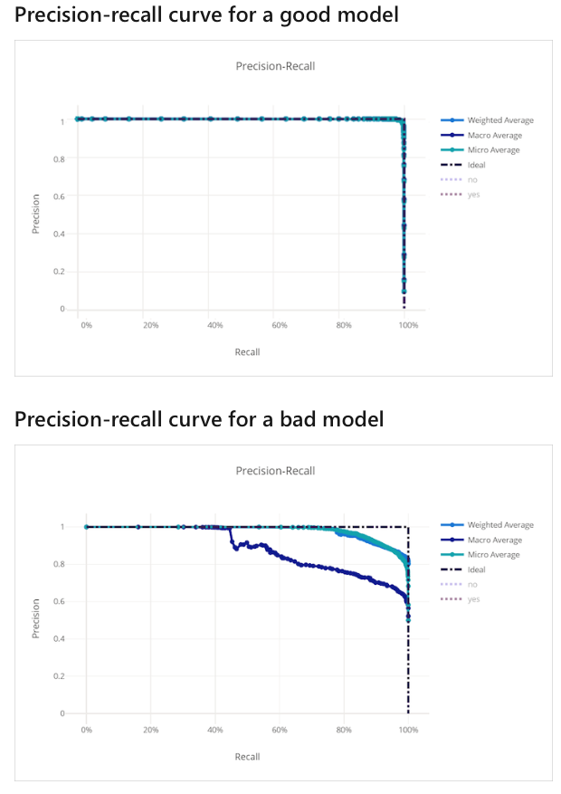

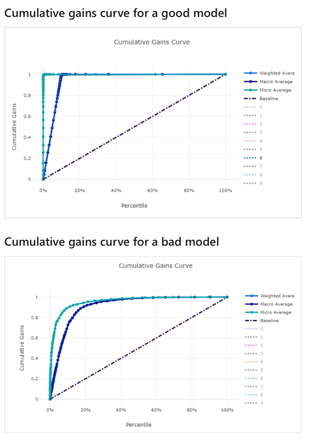

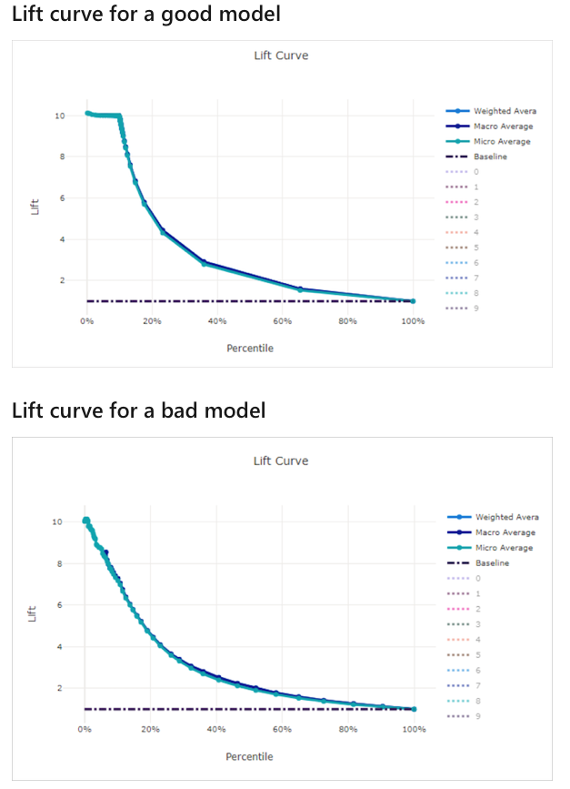

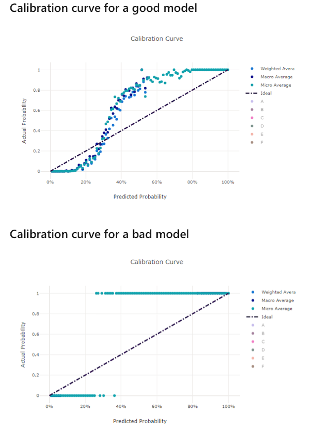

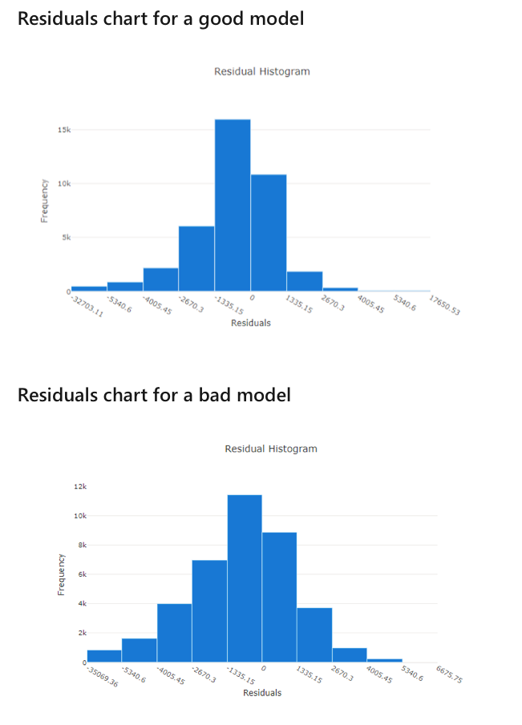

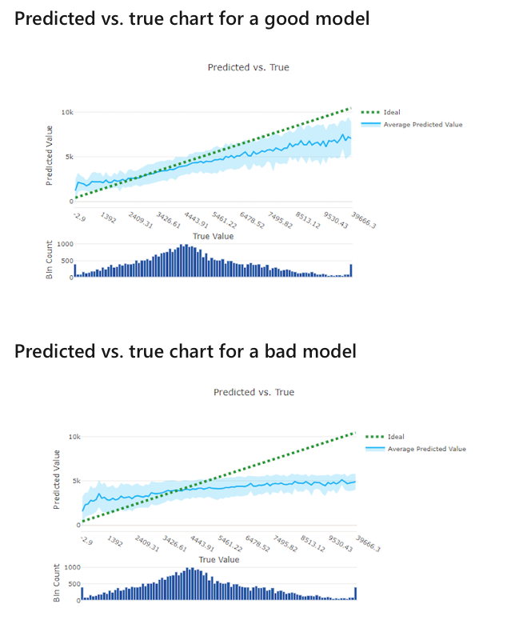

